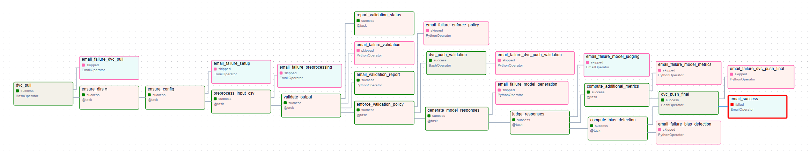

# Break The Bot

Find project overview, see [project_overview.md](./project_overview.md)

## 1. Quick Setup & Run Instructions

Follow these steps in order to set up and run the complete project end-to-end.

---

### 1.1. Clone Repository

```bash
git clone https://github.com/yashichawla/MLOps-Project
cd MLOps-Project
```

---

### 1.2. Create Virtual Environment

```bash
python -m venv venv
source venv/bin/activate   # Mac/Linux
venv\Scripts\activate      # Windows
```

---

### 1.3. Create Environment Files

a) .env file

Generate a new Google App Password for your account. (for email notifications)

Generate a read-only token at https://huggingface.co/settings/tokens. (for running prompts through a victim LLM)

Generate Groq API Key at https://console.groq.com/, sign in using Google, GitHub, or email and create API Key.(for LLM as a Judge)

```bash
AIRFLOW_SMTP_USER=your_email@gmail.com
AIRFLOW_SMTP_PASSWORD=your_gmail_app_password   # 16-digit Google App Password
HF_TOKEN=your_HF_TOKEN
GROQ_API_KEY=your_groq_api
```

b) GCP Secrets JSON (for DVC)

Place the service account key JSON (provided by us in Canvas Submission Comments) inside:

```bash
.secrets/gcp-key.json
```

---

### 1.4. Initialize and Run Airflow with Docker

```bash
# Create logs folder (recommended)
mkdir -p airflow_artifacts/logs

# Initialize Airflow DB and create admin user
docker compose run --rm airflow-init

# Start Airflow services (Webserver + Scheduler + Postgres)
docker compose up -d webserver scheduler
```

Open the Airflow UI:

📍 http://localhost:8080

👤 Username: admin

🔑 Password: admin

You can update credentials in docker-compose.yml later.

Stop services but keep data:

```bash
docker compose down
```

Completely remove containers, logs, and database volumes:

```bash
docker compose down -v
rm -rf airflow_artifacts/logs/*
```

---

### 1.5. (Optional) Test Mode

If you want to skip preprocessing and only validate a CSV:

In Airflow UI → Admin → Variables

Set TEST_MODE = true

---

## 2. Repository Structure

```plaintext
MLOps-Project/
├── .dvc/                         # DVC metadata + remote storage config
├── config/                       # Project-wide configuration files
├── dags/                         # Airflow DAGs for data + model pipelines
├── data/                         # Processed data, metrics, validation outputs (DVC-tracked)
├── documents/                    # PDFs, reports, and project documentation

├── scripts/                      # All pipeline scripts for data, model, judge, metrics, and bias analysis
│   ├── preprocess_salad.py       # Preprocesses raw SALAD data into cleaned, standardized CSV
│   ├── ge_runner.py              # Great Expectations validator (baseline + validation runs)
│   ├── generate_model_responses.py  # Runs adversarial prompts through the victim LLM to produce responses
│   ├── judge.py                  # LLM-as-a-Judge scoring logic for safety + refusal evaluation
│   ├── judge_responses.py        # Orchestrates judgement creation for all model response CSVs
│   ├── bias_detection.py         # Bias slicing + fairness analysis across groups/categories
│   ├── additional_metrics.py     # Computes attack success, refusal stats, and other model metrics

├── tests/                        # Unit tests for validation, preprocessing, and pipeline tasks
├── .airflow.env                  # Airflow environment variables
├── .dockerignore                 # Files excluded from Docker build
├── .dvcignore                    # Files excluded from DVC tracking
├── .gitignore                    # Git ignore rules
├── README.md                     # Main project documentation
├── docker-compose.yml            # Airflow + Postgres + Scheduler stack
├── dvc.lock                      # Auto-generated DVC state file
├── dvc.yaml                      # DVC pipeline definition
├── project_overview.md           # High-level project summary
├── pyproject.toml                # Python project + dependency configuration
├── pytest.ini                    # Pytest configuration
├── requirements-docker.txt       # Dependencies installed inside Docker
├── requirements.txt              # Local development dependencies

```

---

## 3. DAG flow

**DAG Name:** `salad_ml_evaluation_pipeline_v1` (Full ML evaluation pipeline: preprocessing, validation, model response generation, judging, metrics, and bias detection)

**DAG File:** `dags/salad_preprocess_dag.py`

### 3.1. Task Dependency Sequence:

```
Data Pipeline:
dvc_pull → ensure_dirs → ensure_config → preprocess_input_csv → validate_output → [report_validation_status, enforce_validation_policy]

After validation:
enforce_validation_policy → [dvc_push_validation, model_gen]

Model Pipeline:
model_gen → model_judge → [model_metrics, bias_detection] → dvc_push_final → email_success

Note: model_metrics (additional_metrics.py) and bias_detection (bias_detection.py) run in parallel after model_judge completes.
```

---

### 3.2 Email Task Triggers:

- `email_validation_report`: Always runs after validation completes (TriggerRule.ALL_DONE)
- `email_success`: Runs only if all tasks succeed (TriggerRule.ALL_SUCCESS) - requires both data pipeline and model pipeline to complete
- `email_failure_*`: Context-specific failure emails that run when specific tasks fail:
  - Uses `PythonOperator` for model pipeline failures (checks if task actually failed, not skipped)
  - Uses `EmailOperator` for other failures
  - All use appropriate trigger rules (ALL_DONE or ONE_FAILED)



---

## 4. Email Notifications (automatic)

The DAG now uses the unified validator's XCom output for all emails:

| Trigger    | Email                            | Contents                                                                                                                                                                     | Trigger Rule                                     | Operator Type                  |
| ---------- | -------------------------------- | ---------------------------------------------------------------------------------------------------------------------------------------------------------------------------- | ------------------------------------------------ | ------------------------------ |
| Always     | **Validation Report**            | JSON report + anomalies attached                                                                                                                                             | ALL_DONE (runs regardless of task status)        | PythonOperator                 |
| On Success | **✅ DAG Succeeded**             | Comprehensive summary: validation metrics, model metrics table (coverage, over-refusal), bias detection summary (ASR, biased slices), validation report paths, soft warnings | ALL_SUCCESS (only if all upstream tasks succeed) | PythonOperator                 |
| On Failure | **❌ Context-Specific Failures** | Stage-specific failure details (DVC pull, setup, preprocessing, validation, model pipeline, etc.)                                                                            | ALL_DONE or ONE_FAILED                           | EmailOperator / PythonOperator |

---

### 4.1. Trigger Rules Explained:

- `ALL_DONE`: Task runs regardless of upstream task status (used for validation report and failure emails that check task state)
- `ALL_SUCCESS`: Task runs only if all upstream tasks succeed (used for success email)
- `ONE_FAILED`: Task runs if any upstream task fails (used for some failure emails)

---

### 4.2. Email Operator Types:

- `EmailOperator`: Used for basic failure notifications
- `PythonOperator`: Used for success email, validation report, and context-aware failure emails (model pipeline failures) that check if tasks actually failed vs. were skipped

### 4.3. Success Email Contents:

The success email (`email_success`) includes:

- **Execution metadata**: Run ID, execution date, timestamp, CSV path
- **Data validation metrics**: Row count, null prompts, duplicates, unknown rate, text length range
- **Soft warnings**: Any soft warnings from validation
- **Validation report paths**: File paths to anomalies.json and stats.json
- **Model pipeline status**: Execution status for each pipeline stage
- **Model metrics summary table**: Per-model coverage metrics (total prompts, categories, over-refusal rate)
- **Bias detection summary table**: Per-model bias metrics (global ASR, sample count, biased categories/sizes)

Recipients are configured in `salad_preprocess_dag.py` under each email operator.

To add more recipients, edit in salad_preprocess_dag.py:

```bash
to=["athatalnikar@gmail.com", "additional@email.com", "..."]
```

---

## 5. Validation Source of Truth (Required for data pipeline submission)

- `scripts/ge_runner.py` is the validator used by the Airflow DAG.
- The DAG invokes:
  - `python scripts/ge_runner.py baseline --input <csv> --date YYYYMMDD` (creates `data/metrics/schema/baseline/schema.json` if missing)
  - `python scripts/ge_runner.py validate --input <csv> --baseline_schema <path> --date YYYYMMDD`
- Validation artifacts (source of truth):
  - `data/metrics/stats/YYYYMMDD/stats.json` (includes row_count, null/dup counts, unknown_category_rate, text_len_min/max, size_label_mismatch_count)
  - `data/metrics/validation/YYYYMMDD/anomalies.json` (hard_fail, soft_warn, info)
- Airflow reads these files to construct the XCom metrics used for gating and email reports.

---

## 6. DVC Usage Guide

This repository integrates DVC (Data Version Control) with Google Cloud Storage (GCS) to version datasets and validation artifacts generated by the Salad data pipeline.

DVC is used to track and version the following pipeline outputs:

```text
data/processed/processed_data.csv
data/metrics/stats
data/metrics/validation
data/metrics/                    # Additional metrics (additional_metrics_*.json, schema/)
data/responses/                   # Model response CSVs
data/judge/                       # Judge LLM evaluation CSVs
data/bias/                        # Bias detection reports and slice metrics
```

These are stored remotely in a GCS bucket and automatically synchronized through Airflow tasks (dvc pull / dvc push) running inside Docker.

---

### 6.1 When You Modify the Pipeline or Data

#### 6.1.1 When You Modify Pipeline Scripts or Dependencies

If you modify scripts, dependencies, or the `salad_preprocess` stage (which actually generates outputs):

```bash
dvc repro
git add dvc.yaml dvc.lock
git commit -m "Update DVC pipeline or data sources"
dvc push
git push
```

This regenerates outputs by running the DVC stage commands.

#### 6.1.2 When You Add New Tracking Stages to dvc.yaml

If you add new stages to `dvc.yaml` that track existing outputs (e.g., `model_responses`, `judge_outputs`, `bias_detection`, `additional_metrics`):

```bash
dvc commit -f
git add dvc.yaml dvc.lock
git commit -m "Add new DVC tracking stages"
dvc push
git push
```

**Why `dvc repro` is not needed:**

- New tracking stages have placeholder commands (e.g., `echo "Model responses generated by Airflow DAG"`) that don't actually generate outputs
- Outputs are generated by Airflow tasks, not by DVC stages
- `dvc commit` associates existing outputs with the new stages without regenerating anything
- `dvc repro` would only run the placeholder `echo` commands, which don't create any files

**Example:** When adding `model_responses`, `judge_outputs`, `bias_detection`, and `additional_metrics` stages, these outputs already exist from previous Airflow DAG runs. You only need `dvc commit` to tell DVC to track them, not `dvc repro` to regenerate them.

---

### 6.2 Remote Storage Details

```text
GCS Bucket: gs://mlops-project-dvc
GCP Project ID: break-the-bot
```

---

## 7. Bias Detection & Mitigation Document (Required for data pipeline submission)

Located in /documents/bias_detection_mitigation.md — explains bias definition, detection via data slicing, mitigation strategies, and fairness calibration.

---

## 8. DAG Execution Timeline (Gannt Chart Overview) (Required for data pipeline submission)

- The DAG starts with dvc_pull, which is the longest-running task (~15s) since it fetches tracked data from remote storage.
- Set up tasks like ensure_dirs and ensure_config complete quickly (a few seconds each).
- preprocess_input_csv and validate_output are moderate in duration, taking several seconds depending on the dataset size.
- Validation follow-ups (report_validation_status, enforce_validation_policy) run in parallel almost instantly after validation completes.
- dvc_push is another longer task (~10–12s) as it uploads outputs and validation reports back to remote storage.
- Notification tasks:
  - `email_validation_report` always runs after validation (ALL_DONE)
  - `email_success` runs only on full success when both data pipeline and model pipeline complete (ALL_SUCCESS)
  - Context-specific failure emails (`email_failure_*`) run when specific tasks fail, with model pipeline failures (including bias_detection) using PythonOperator to check if tasks actually failed (not skipped)
- Model pipeline metrics tasks:
  - `compute_additional_metrics` and `compute_bias_detection` run in parallel after `judge_responses` completes
  - Both require judgements CSV files from `judge_responses` task
  - `compute_additional_metrics` also requires response CSVs from `generate_model_responses`


---

## 9. Tests (Required for data pipeline submission)

Usage:
To run the test suite, from repository root( uses `pytest.ini` with `testpaths = tests`):

```bash
pytest -q
```

To execute a single file:

```bash
pytest MLOps-Project/tests/test_preprocess_salad.py -q
```

Artifacts: GE validation tests write JSON to `data/metrics/stats/<date>/stats.json` and `data/metrics/validation/<date>/anomalies.json`.

---

## 10. Model Pipeline (As part of model pipeline submission)

We now have **four additional scripts** that complete the model-processing workflow end-to-end. Alongwith DVC and DAG changes.
Below is a short summary of each, with placeholder names and corresponding output files.

---

### 10.1 Run Adversarial Prompts Through Model

**Script:** `scripts/generate_model_responses.py`

**Output:** `data/responses/model_responses_<model_name>.csv`

Runs all adversarial prompts (from the processed SALAD dataset) through the selected victim LLM and stores the raw model responses along with metadata (latency, status, size labels, etc.).

---

### 10.2 Judge LLM — Evaluate Responses for Safety

**Utils script:** `scripts/judge.py`

**Script:** `scripts/judge_responses.py`

**Output:** `data/judge/judgements_<model_name>.csv`

Takes each **(prompt, response)** pair and sends it to the Judge LLM to score safety, refusal strength, violation types, and explanation.

More details information at : [judge_llm.pdf](documents/judge_llm.pdf)

---

### 10.3 Bias Detection Module

**Script:** `scripts/bias_detection.py`

**Output:** `data/bias/bias_report_<model_name>.json`

Runs bias-slicing analysis on the judged responses to detect disparities across categories and demographic slices.

More detailed methodology reference at: [bias_stats.pdf](documents/bias_stats.md)

---

### 10.4 Model Metrics Computation

**Script:** `scripts/additional_metrics.py`

**Output:** `data/metrics/additional_metrics_<model_name>.json`

Computes <>.
Detailed metric definitions at: [additional_metrics.pdf](documents/additional_metrics.pdf)

---
