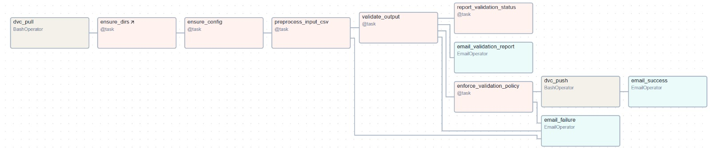
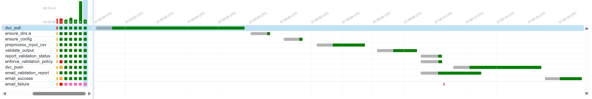

# Break The Bot

Find project overview, see [project_overview.md](./project_overview.md)
## 1. Quick Setup & Run Instructions

Follow these steps in order to set up and run the complete project end-to-end.

1.1. Clone Repository
```bash
git clone https://github.com/yashichawla/MLOps-Project
cd MLOps-Project
```

1.2. Create Virtual Environment
```bash
python -m venv venv
source venv/bin/activate   # Mac/Linux
venv\Scripts\activate      # Windows
```

1.3. Create Environment Files
a) SMTP .env file (for email notifications)

Generate a new Google App Password for your account. 

Create a file named .env in the project root:
```bash
AIRFLOW_SMTP_USER=your_email@gmail.com
AIRFLOW_SMTP_PASSWORD=your_gmail_app_password   # 16-digit Google App Password
```

b) GCP Secrets JSON (for DVC)

Place the service account key JSON (provided by us in Canvas Submission Comments) inside:
```bash
.secrets/gcp-key.json
```

1.4. Initialize and Run Airflow with Docker
```bash
# Create logs folder (recommended)
mkdir -p airflow_artifacts/logs

# Initialize Airflow DB and create admin user
docker compose run --rm airflow-init

# Start Airflow services (Webserver + Scheduler + Postgres)
docker compose up -d webserver scheduler
```

Open the Airflow UI:

📍 http://localhost:8080

👤 Username: admin

🔑 Password: admin

You can update credentials in docker-compose.yml later.

Stop services but keep data:
```bash
docker compose down
```

Completely remove containers, logs, and database volumes:
```bash
docker compose down -v
rm -rf airflow_artifacts/logs/*
```

1.5. (Optional) Test Mode

If you want to skip preprocessing and only validate a CSV:

In Airflow UI → Admin → Variables

Set TEST_MODE = true

## 2. Repository Structure

```plaintext
MLOps-Project/
├── .dvc/
│   ├── .gitignore                     # Ignore DVC cache or temp files from version control
│   └── config                         # DVC configuration file defining remote storage (e.g., GCS bucket)
├── dags/                              # Airflow DAGs
│   └── salad_preprocess_dag.py        # Main DAG (preprocessing + single validation + email alerts)
├── scripts/
│   ├── preprocess_salad.py            # Data preprocessing pipeline
│   ├── ge_runner.py                   # Great Expectations Validator
│   └── utils/                         # Shared helper modules (if any)
├── config/
│   └── data_sources.json              # Config file for multi-source data ingestion
├── data/
│   ├── processed/                     # Output CSV (processed_data.csv)
│   ├── metrics/                       # Stats + validation results (used by Airflow + GE)
│   └── test_validation/               # Test CSVs for test-mode runs
├── documents/                         # Documents related to assignment submissions
├── tests/                             # Unit Test scripts for all components
├── .airflow.env                       # Environment variables for local Airflow setup (e.g., connections, paths)
├── .dockerignore                      # Files and folders excluded from the Docker build context
├── .dvcignore                         # Files and folders excluded from DVC tracking
├── .gitignore                         # Files and folders excluded from Git tracking
├── pyproject.toml                     # Project metadata and dependency management configuration
├── docker-compose.yml                 # Airflow + Postgres stack
├── dvc.lock                           # Auto-generated file tracking exact data and pipeline versions
├── dvc.yaml                           # Defines the DVC pipeline stages (data processing, training, etc.)
├── requirements.txt                   # Dev dependencies (includes pandas, airflow, etc.)
├── requirements-docker.txt            # Installed inside Docker containers
└── README.md
```

### Setup Instructions:

1. Clone Repository

```bash
git clone https://github.com/yashichawla/MLOps-Project
cd MLOps-Project
```

2. Create Virtual Environment

```bash
   python -m venv venv
   source venv/bin/activate # On Mac/Linux
   venv\Scripts\activate # On Windows
```

### Features:

- Evaluator Service: Runs prompts against target models and logs results.
- Judge Service: Scores responses for safety and refusal quality.
- Dashboards: Grafana visualizations for safety trends, ASR, and alerts.
- CI/CD Integration: Blocks unsafe deployments if safety metrics fail.
- Failure Analysis: Clustering and regression testing of jailbreak cases.

### Key Metrics:

- Attack Success Rate (ASR) - % of successful jailbreaks.
- Refusal Quality - judged clarity and robustness of refusals.
- Coverage Metrics - number and diversity of tested adversarial prompts.

### Project Timeline:

- Week 1-2: Repo setup, governance policy, seed prompt generation.
- Week 3-4: Prompt generator + evaluator API.
- Week 5-6: Judge API + calibration with human labels.
- Week 7-8: Dashboards, monitoring, failure analysis.
- Week 9-10: CI/CD gates, final validation, and reporting.

### Setting up and running Airflow (with Docker)

```bash
# Navigate to project root
cd MLOps-Project

# (Optional but recommended) Create logs folder
mkdir -p airflow_artifacts/logs

# Initialize Airflow database + admin user in Docker
docker compose run --rm airflow-init
# Only for setup, after that just need to use compose up

#Start Airflow (Webserver + Scheduler + Postgres)
docker compose up -d webserver scheduler
```

Then open the UI:

📍 http://localhost:8080

👤 Username: admin
🔑 Password: admin

(This can be changed in docker-compose later if needed.)

To stop services but keep the database & logs:

```bash
docker compose down
```

To stop and remove everything (Postgres DB, logs, container volumes):

```bash
docker compose down -v       # removes DB volume
rm -rf airflow_artifacts/logs/*
```

### Airflow Test Mode (Validation-only workflow)

Use this when you want to skip preprocessing and only validate a CSV.

In the Airflow UI, open Admin → Variables, and set:
- `TEST_MODE` to `true` to activate test mode (default: `false`)
- `TEST_CSV_PATH` to the path of your test CSV (default: `data/test_validation/test.csv`)

When TEST_MODE is enabled, the DAG skips preprocessing and validates the CSV specified in TEST_CSV_PATH instead.

#### DAG flow

**Task Dependency Sequence:**
```
dvc_pull → ensure_dirs → ensure_config → preprocess_input_csv → validate_output → [report_validation_status, enforce_validation_policy] → (on success) dvc_push → email_success
```

**Email Task Triggers:**
- `email_validation_report`: Always runs after validation completes (TriggerRule.ALL_DONE)
- `email_success`: Runs only if all tasks succeed (TriggerRule.ALL_SUCCESS)
- `email_failure`: Runs if any task in the core path fails (TriggerRule.ONE_FAILED)



# Validation Source of Truth

- `scripts/ge_runner.py` is the single validator used by the Airflow DAG.
- The DAG invokes:
  - `python scripts/ge_runner.py baseline --input <csv> --date YYYYMMDD` (creates `data/metrics/schema/baseline/schema.json` and `data/metrics/stats/baseline/stats.json` if missing; baseline stats.json is used for drift detection in subsequent validations)
  - `python scripts/ge_runner.py validate --input <csv> --baseline_schema <path> --date YYYYMMDD`
- **Note:** Baseline is automatically created if missing during the first validation run.
- Validation artifacts (source of truth):
  - `data/metrics/stats/YYYYMMDD/stats.json` (includes row_count, null/dup counts, unknown_category_rate, text_len_min/max, size_label_mismatch_count)
  - `data/metrics/validation/YYYYMMDD/anomalies.json` (contains metadata, summary, hard_fail, and soft_warn sections; metadata includes validation timestamp/source, summary includes validation_status and counts)
- Airflow reads these files to construct the XCom metrics used for gating and email reports.

### SMTP Setup (Gmail)

Create .env file in project root:

```in
AIRFLOW_SMTP_USER=your_email@gmail.com
AIRFLOW_SMTP_PASSWORD=your_gmail_app_password   # Generate Google App Password (16 digit code)
```

## 📧 Email Notifications (automatic)

The DAG now uses the unified validator's XCom output for all emails:

| Trigger    | Email                 | Contents                         | Trigger Rule        |
| ---------- | --------------------- | -------------------------------- | ------------------- |
| Always     | **Validation Report** | JSON report + anomalies attached | ALL_DONE (runs regardless of task status) |
| On Success | **✅ DAG Succeeded**  | Summary of counts and ranges     | ALL_SUCCESS (only if all upstream tasks succeed) |
| On Failure | **❌ DAG Failed**     | Hard-fail reasons + report paths | ONE_FAILED (if any upstream task fails) |

**Trigger Rules Explained:**
- `ALL_DONE`: Task runs regardless of upstream task status (used for validation report)
- `ALL_SUCCESS`: Task runs only if all upstream tasks succeed (used for success email)
- `ONE_FAILED`: Task runs if any upstream task fails (used for failure email)

Recipients are configured in `salad_preprocess_dag.py` under each `EmailOperator`.

To add more recipients, edit in salad_preprocess_dag.py:

```bash
to=["athatalnikar@gmail.com", "additional@email.com", "..."]
```

## 5. Validation Source of Truth

- `scripts/ge_runner.py` is the validator used by the Airflow DAG.
- The DAG invokes:
  - `python scripts/ge_runner.py baseline --input <csv> --date YYYYMMDD` (creates `data/metrics/schema/baseline/schema.json` if missing)
  - `python scripts/ge_runner.py validate --input <csv> --baseline_schema <path> --date YYYYMMDD`
- Validation artifacts (source of truth):
  - `data/metrics/stats/YYYYMMDD/stats.json` (includes row_count, null/dup counts, unknown_category_rate, text_len_min/max, size_label_mismatch_count)
  - `data/metrics/validation/YYYYMMDD/anomalies.json` (hard_fail, soft_warn, info)
- Airflow reads these files to construct the XCom metrics used for gating and email reports.

## 6. DVC Usage Guide

This repository integrates DVC (Data Version Control) with Google Cloud Storage (GCS) to version datasets and validation artifacts generated by the Salad data pipeline.

DVC is used to track and version the following pipeline outputs:

```text
data/processed/processed_data.csv
data/metrics/stats
data/metrics/validation
```

These are stored remotely in a GCS bucket and automatically synchronized through Airflow tasks (dvc pull / dvc push) running inside Docker.

### 🔐 2. Authentication via Service Account Key

This setup uses a GCP service account key mounted securely into the Airflow containers.

Steps (one-time):

1. Place the service account key JSON (provided by us in Canvas Submission Comments) inside. :
   .secrets/gcp-key.json

2. The Docker Compose file mounts it automatically:

```yaml
volumes:
  - ./.secrets/gcp-key.json:/opt/airflow/secrets/gcp-key.json:ro
environment:
  GOOGLE_APPLICATION_CREDENTIALS: /opt/airflow/secrets/gcp-key.json
```

3. DVC and all Airflow tasks use this environment variable for authentication to GCS.

### 🧱 3. Running Inside Airflow (Containerized)

The Airflow DAG (salad_preprocess_dag.py) orchestrates:

- dvc pull at pipeline start — ensures the latest data version is fetched.
- Preprocessing & validation tasks.
- dvc push after completion — uploads new artifacts to the GCS remote

All commands run automatically inside the Airflow Docker containers — no CLI interaction is needed.

For Local Debugging (Optional)

If you wish to run DVC manually outside Docker:

```bash
pip install -r requirements.txt
$env:GOOGLE_APPLICATION_CREDENTIALS = "D:\MLOps-Project\.secrets\gcp-key.json"
dvc pull       # fetch data from GCS
dvc repro      # rebuild pipeline
dvc push       # upload results
```

### 6.1 When You Modify the Pipeline or Data

```bash
dvc repro
git add dvc.yaml dvc.lock
git commit -m "Update DVC pipeline or data sources"
dvc push
git push
```

### 6.2 Remote Storage Details

```text
GCS Bucket: gs://mlops-project-dvc
GCP Project ID: break-the-bot
```

## 7. Bias Detection & Mitigation Document

Located in /documents/bias_detection_mitigation.md — explains bias definition, detection via data slicing, mitigation strategies, and fairness calibration.

## 8. DAG Execution Timeline (Gannt Chart Overview)

- The DAG starts with dvc_pull, which is the longest-running task (~15s) since it fetches tracked data from remote storage.
- Set up tasks like ensure_dirs and ensure_config complete quickly (a few seconds each).
- preprocess_input_csv and validate_output are moderate in duration, taking several seconds depending on the dataset size.
- Validation follow-ups (report_validation_status, enforce_validation_policy) run in parallel almost instantly after validation completes.
- dvc_push is another longer task (~10–12s) as it uploads outputs and validation reports back to remote storage.
- Notification tasks: email_validation_report always runs after validation; email_success runs only on full success; email_failure runs if any task fails.



## 9. Tests
Usage:
To run the test suite, from repository root( uses `pytest.ini` with `testpaths = tests`):
```bash
pytest -q
```

To execute a single file: 
```bash
pytest MLOps-Project/tests/test_preprocess_salad.py -q
```
Artifacts: GE validation tests write JSON to `data/metrics/stats/<date>/stats.json` and `data/metrics/validation/<date>/anomalies.json`.


